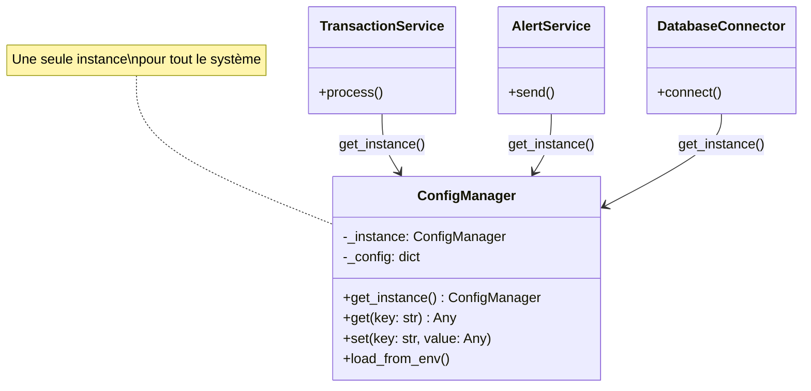

# Jour 01 — Singleton Pattern : ConfigManager

## Le problème concret

BankCore démarre avec un problème fondamental : **qui détient la configuration ?**

Chaque module a besoin de savoir :
- L'URL de la base de données
- Les taux de frais par type de transaction
- Les limites (montant max par virement, tentatives de connexion)
- L'environnement (dev / staging / production)

Sans architecture, chaque développeur crée sa propre instance de config.
Résultat : des valeurs incohérentes entre modules, des fichiers `.env` lus
10 fois au démarrage, et impossible de changer un paramètre en production
sans redémarrer tout le système.

---

## La décision

**Utiliser le pattern Singleton pour le ConfigManager.**

Une seule instance, partagée par tous les modules, initialisée une fois au
démarrage.

---

## Diagramme



**Avant (sans Singleton) :**
```
TransactionService → Config()  ← instance 1
AlertService       → Config()  ← instance 2 (peut diverger)
DatabaseConnector  → Config()  ← instance 3 (peut diverger)
```

**Après (avec Singleton) :**
```
TransactionService ──┐
AlertService       ──┼──→ ConfigManager._instance (unique)
DatabaseConnector  ──┘
```

---

## Pourquoi ce pattern, et pas un autre ?

**Alternatives considérées :**

| Alternative | Problème |
|------------|----------|
| Variable globale | Pas de contrôle d'accès, testabilité nulle |
| Passer la config en paramètre | 15 paramètres dans chaque constructeur |
| Recharger le fichier à chaque accès | Performance, incohérence possible |
| **Singleton** | ✅ Une instance, accès simple, testable via reset |

**Compromis accepté :** le Singleton est difficile à tester en isolation
(état global). On résout ça avec une méthode `_reset()` réservée aux tests
et on reviendra dessus au Jour 10 (Dependency Inversion) avec une vraie
injection de dépendances.

---

## Ce que ce jour pose pour la suite

- **Jour 02** : `AccountFactory` lira la config pour connaître les limites par type de compte
- **Jour 03** : `AlertSystem` lira la config pour les seuils d'alerte
- **Jour 10** : on remplacera l'accès direct au Singleton par de l'injection de dépendances
- **Jour 14** : `DatabaseConnector` utilisera la config pour choisir l'implémentation du Repository

---

## Complexité aujourd'hui

- 1 fichier source : `config_manager.py`
- 1 fichier de test : `test_config_manager.py`
- 0 dépendance externe
- Lignes de code : ~60

C'est volontairement simple. L'objectif du Jour 01 n'est pas d'impressionner —
c'est de poser une fondation solide sur laquelle les 29 jours suivants vont s'appuyer.
