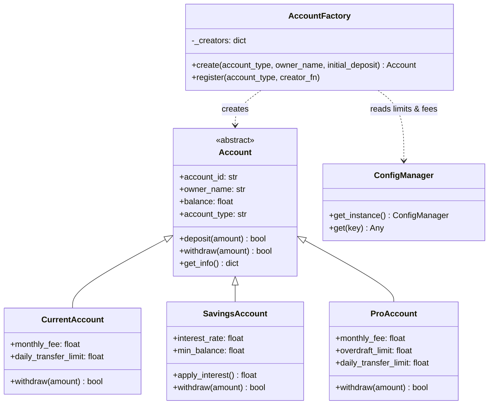

# Jour 02 — Factory Pattern : AccountFactory

## Le problème concret

BankCore doit gérer trois types de comptes bancaires :

- **Compte Courant** : pas de minimum de solde, frais mensuels de 2€, virement plafonné à 10 000€/jour
- **Compte Épargne** : solde minimum de 50€, taux d'intérêt annuel de 2.5%, pas de virement entrant plafonné
- **Compte Pro** : frais mensuels de 15€, plafond à 50 000€/jour, découvert autorisé jusqu'à -5 000€

Sans architecture, chaque endroit du code qui crée un compte ressemble à ça :

```python
# Partout dans le code — couplage fort, duplication, fragile
if account_type == "savings":
    account = Account()
    account.min_balance = 50.0
    account.interest_rate = 0.025
    account.monthly_fee = 0.0
    account.overdraft_limit = 0.0
elif account_type == "current":
    account = Account()
    account.min_balance = 0.0
    account.monthly_fee = 2.0
    ...
```

**Le problème :** ajouter un type "Compte Jeune" nécessite de chercher
et modifier chaque `if account_type ==` dans tout le codebase.
Un oubli = un bug silencieux en production.

---

## La décision

**Utiliser le Factory Method Pattern.**

Une seule classe `AccountFactory` centralise toute la logique de création.
Le reste du code appelle `AccountFactory.create("savings", ...)` et
ne sait jamais ce qui se passe à l'intérieur.

---

## Diagramme



**Flux de création :**
```
Code client
    │
    ▼
AccountFactory.create("savings", "Alice", 500.0)
    │
    ├── Lit les limites depuis ConfigManager (Jour 01)
    ├── Instancie SavingsAccount
    ├── Applique les règles métier
    └── Retourne Account (type abstrait)
        │
        ▼
    Le client ne sait pas que c'est un SavingsAccount
```

---

## Pourquoi ce pattern, et pas un autre ?

| Alternative | Problème |
|------------|----------|
| `if/elif` partout | Duplication, fragile, viole Open/Closed |
| Constructeur avec paramètres | 10 paramètres optionnels, illisible |
| Héritage direct par le client | Couplage fort aux classes concrètes |
| **Factory** | ✅ Un seul point de création, extensible, lisible |

**Compromis accepté :** la Factory doit être mise à jour quand on ajoute
un nouveau type de compte. On atténue ça avec un registre dynamique
(`register()`) — Jour 07 (OCP) explorera comment aller encore plus loin.

---

## Lien avec le Jour 01

`AccountFactory` lit la configuration depuis `ConfigManager` (Jour 01) :
- Les frais mensuels (`fees.monthly_account`)
- Le plafond de virement (`limits.max_transfer_amount`)
- Le seuil d'alerte de solde bas (`alerts.low_balance_threshold`)

Si ces valeurs changent en production via variable d'environnement,
tous les comptes créés après ce changement respectent automatiquement
les nouvelles règles — sans modifier le code.

---

## Ce que ce jour pose pour la suite

- **Jour 03** : `AlertSystem` sera notifié à chaque création de compte (Observer)
- **Jour 04** : `FeeCalculator` utilisera la Strategy pour varier les frais par type
- **Jour 08** : on vérifiera que `SavingsAccount` et `CurrentAccount` sont
  substituables partout où `Account` est attendu (LSP)
- **Jour 14** : `AccountRepository` stockera ces objets sans connaître leur type concret

---

## Complexité aujourd'hui

- 2 fichiers source : `account.py`, `account_factory.py`
- 1 fichier de test : `test_account_factory.py`
- 0 nouvelle dépendance externe
- Lignes de code : ~140
