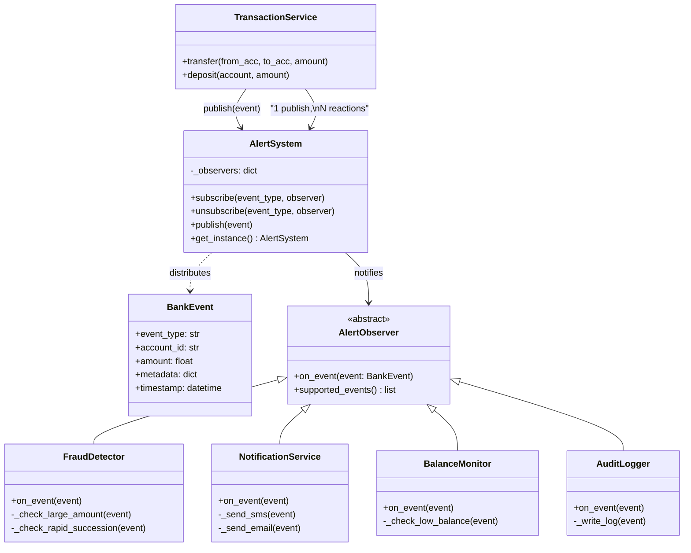

# Jour 03 — Observer Pattern : AlertSystem

## Le problème concret

Chaque transaction bancaire doit déclencher plusieurs réactions :

- **Détection de fraude** : montant inhabituel ? transaction à l'étranger ?
- **Notification SMS/Email** : informer le client
- **Analytics** : enregistrer pour les rapports
- **Alerte découvert** : prévenir si le solde passe sous le seuil

Sans architecture, `TransactionService` ressemble à ça :

```python
def process_transfer(self, from_account, to_account, amount):
    # Logique de virement...
    from_account.withdraw(amount)
    to_account.deposit(amount)

    # Couplage direct — le service de transaction
    # connaît tous les autres services
    self.fraud_service.check(from_account, amount)
    self.sms_service.send(from_account.owner, amount)
    self.analytics.record(from_account, amount)
    self.alert_service.check_balance(from_account)
    # Ajouter "audit log" = modifier cette méthode
```

**Les problèmes :**
1. `TransactionService` dépend de 4 services — couplage fort
2. Ajouter un service = modifier le code existant — fragile
3. Tester `TransactionService` nécessite mocker 4 dépendances
4. L'ordre d'exécution est figé dans le code

---

## La décision

**Utiliser le pattern Observer (Event-Driven) pour l'AlertSystem.**

`TransactionService` émet un événement. Les observateurs s'inscrivent
et réagissent indépendamment. `TransactionService` ne sait pas combien
d'observateurs existent ni ce qu'ils font.

---

## Diagramme



**Flux d'un virement :**
```
TransactionService.transfer(alice, bob, 6000€)
    │
    ├── alice.withdraw(6000)
    ├── bob.deposit(6000)
    │
    └── alert_system.publish(BankEvent("transfer", alice.id, 6000))
                │
                ├── FraudDetector.on_event()     → "montant > seuil, alerte!"
                ├── NotificationService.on_event() → "SMS envoyé à Alice"
                ├── BalanceMonitor.on_event()     → "solde bas détecté"
                └── AuditLogger.on_event()        → "log écrit"
```

---

## Pourquoi ce pattern, et pas un autre ?

| Alternative | Problème |
|------------|----------|
| Appels directs | Couplage fort, fragile à l'ajout |
| Callbacks passés en paramètre | Prolifération de paramètres |
| Héritage | Un seul comportement possible |
| Queue asynchrone (Kafka) | Trop tôt — complexité injustifiée à ce stade |
| **Observer synchrone** | ✅ Simple, découplé, testable, extensible |

**Compromis accepté :** l'Observer ici est **synchrone** — les observateurs
s'exécutent dans l'ordre et bloquent `TransactionService`.
Si `NotificationService` est lent, le virement attend.
On résoudra ça au **Jour 18 (Message Queue)** avec de l'asynchronisme.

---

## Connexion avec les jours précédents

- **Jour 01 (ConfigManager)** : `AlertSystem` lit les seuils depuis la config
  (`alerts.low_balance_threshold`, `alerts.large_transaction_threshold`)
- **Jour 02 (AccountFactory)** : les événements portent les infos de compte
  via `account.get_info()` — le dict standardisé posé au Jour 02

---

## Ce que ce jour pose pour la suite

- **Jour 04** : `FeeCalculator` publiera un événement `fee.applied` après
  chaque calcul de frais — les analytics l'écouteront
- **Jour 06** : on extraira `TransactionService` du monolithe grâce au
  découplage que l'Observer a rendu possible (SRP)
- **Jour 18** : l'Observer synchrone sera remplacé par une queue
  asynchrone pour les notifications — sans changer `TransactionService`

---

## Complexité aujourd'hui

- 3 fichiers source : `events.py`, `alert_system.py`, `transaction_service.py`
- 1 fichier de test : `test_alert_system.py`
- 0 nouvelle dépendance externe
- Lignes de code : ~200
