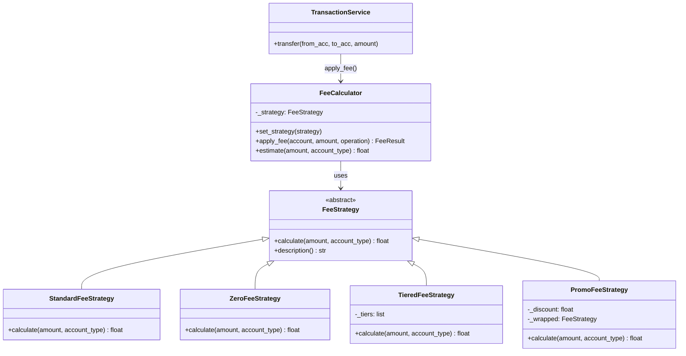

# Jour 04 — Strategy Pattern : FeeCalculator

## Le problème concret

BankCore applique des frais différents selon le type de compte et
d'opération. Sans architecture :

```python
def calculate_fee(self, account, amount, operation):
    if account.account_type == "current":
        if operation == "transfer":
            return amount * 0.001
        elif operation == "international":
            return amount * 0.02
    elif account.account_type == "pro":
        if operation == "transfer":
            return amount * 0.0005  # tarif préférentiel
        ...
    elif account.account_type == "savings":
        return 0.0  # pas de frais
```

**Les problèmes :**
1. Ajouter un nouveau type de compte = modifier cette méthode
2. Ajouter un nouveau type d'opération = modifier cette méthode
3. Les règles de tarification sont enfouies dans la logique de transaction
4. Impossible de tester une règle tarifaire isolément

---

## La décision

**Utiliser le Strategy Pattern pour le FeeCalculator.**

Chaque règle tarifaire est encapsulée dans une classe séparée.
`FeeCalculator` reçoit une stratégie et l'applique sans connaître
ses détails. Changer de tarification = changer de stratégie.

---

## Diagramme



**Flux d'un virement avec frais :**
```
TransactionService.transfer(alice, bob, 1000€)
    │
    └── fee_calculator.apply_fee(alice, 1000, "transfer")
              │
              └── strategy.calculate(1000, "current")
                        │
                        ├── StandardFeeStrategy → 1.00 EUR (0.1%)
                        ├── TieredFeeStrategy   → 0.75 EUR (tier 500-5k)
                        └── ZeroFeeStrategy     → 0.00 EUR
```

---

## Pourquoi ce pattern, et pas un autre ?

| Alternative | Problème |
|------------|----------|
| if/elif dans FeeCalculator | Fragile, viole Open/Closed |
| Héritage de FeeCalculator | Explosion de classes, rigide |
| Table de lookup en BDD | Sur-engineering à ce stade |
| **Strategy** | ✅ Isolé, testable, swappable à runtime |

**Compromis accepté :** `PromoFeeStrategy` enveloppe une autre stratégie
(pattern Decorator sur une Strategy). C'est intentionnel — montrer que
les patterns se combinent naturellement. Jour 09 (ISP) clarifiera
les interfaces pour éviter que ça devienne confus.

---

## Connexion avec les jours précédents

- **Jour 01 (ConfigManager)** : les taux par défaut viennent de la config
- **Jour 02 (AccountFactory)** : `account.account_type` détermine la stratégie
- **Jour 03 (AlertSystem)** : `FeeCalculator` publie un événement `fee.applied`
  après chaque prélèvement — les analytics l'écoutent

---

## Ce que ce jour pose pour la suite

- **Jour 05 (Decorator)** : `TransactionDecorator` enrichira les transactions
  avec validation et logging — sans modifier `TransactionService`
- **Jour 07 (OCP)** : on formalisera comment ajouter une nouvelle stratégie
  tarifaire sans toucher aux existantes
- **Jour 10 (DIP)** : `FeeCalculator` recevra sa stratégie par injection
  plutôt que de la choisir elle-même

---

## Complexité aujourd'hui

- 2 fichiers source : `fee_strategy.py`, `fee_calculator.py`
- 1 fichier de test : `test_fee_calculator.py`
- `TransactionService` mis à jour pour intégrer les frais
- 0 nouvelle dépendance externe
- Lignes de code : ~180
