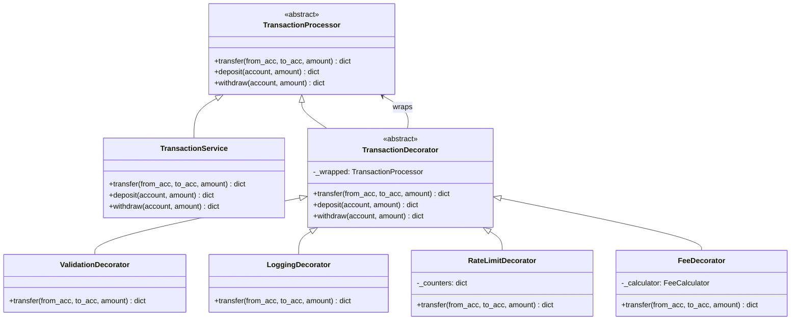

# Jour 05 — Decorator Pattern : TransactionPipeline

## Le problème concret

`TransactionService.transfer()` grossit à chaque sprint :

```python
def transfer(self, from_account, to_account, amount):
    # Sprint 1 : logique métier
    from_account.withdraw(amount)
    to_account.deposit(amount)

    # Sprint 2 : validation ajoutée
    if amount <= 0: raise ValueError(...)
    if not from_account: raise ValueError(...)

    # Sprint 3 : logging ajouté
    logger.info(f"Transfer {amount} from {from_account.id}...")
    start = time.perf_counter()
    # ... logique ...
    logger.info(f"Done in {time.perf_counter() - start:.3f}s")

    # Sprint 4 : rate limiting ajouté
    if self._rate_limiter.is_exceeded(from_account.id):
        raise RateLimitError(...)

    # Sprint 5 : frais ajoutés
    fee = self._fee_calculator.apply_fee(...)
    from_account.withdraw(fee.fee)
```

**Le résultat :** une méthode de 80 lignes qui mélange
validation, logging, rate limiting et logique métier.
Impossible à tester isolément. Impossible à réutiliser partiellement.

---

## La décision

**Utiliser le Decorator Pattern pour créer un pipeline de transaction.**

Chaque responsabilité transversale devient un Decorator indépendant.
On les empile autour de `TransactionService` dans l'ordre voulu.
`TransactionService` retrouve sa responsabilité unique : déplacer de l'argent.

---

## Diagramme



**Pipeline d'un virement (de l'extérieur vers l'intérieur) :**
```
RateLimitDecorator.transfer(alice, bob, 1000)
    └── LoggingDecorator.transfer(alice, bob, 1000)
            └── ValidationDecorator.transfer(alice, bob, 1000)
                    └── FeeDecorator.transfer(alice, bob, 1000)
                            └── TransactionService.transfer(alice, bob, 1000)
                                    └── alice.withdraw(1000)
                                    └── bob.deposit(1000)
                                    └── alert_system.publish(...)
```

---

## Pourquoi ce pattern, et pas un autre ?

| Alternative | Problème |
|------------|----------|
| Tout dans TransactionService | Viole SRP, non testable isolément |
| Héritage (TransactionServiceWithLogs) | Explosion combinatoire, rigide |
| Middleware list (Django-style) | Valide mais plus complexe à wirer |
| **Decorator** | ✅ Même interface, empilable, chaque couche testable seule |

**Compromis accepté :** l'ordre des Decorators est fixé à la construction.
Si l'ordre importe (valider AVANT de logguer), c'est la responsabilité de
l'assembleur. On formalisera ça au Jour 11 (Architecture en couches) avec
un `PipelineBuilder` explicite.

---

## Connexion avec les jours précédents

- **Jour 01 (ConfigManager)** : `RateLimitDecorator` lit le max de transactions
  par minute depuis la config
- **Jour 03 (AlertSystem)** : `LoggingDecorator` publie des événements
  structurés plutôt que des logs bruts
- **Jour 04 (Strategy)** : `FeeDecorator` utilise `FeeCalculator` qui
  encapsule la stratégie tarifaire

---

## Ce que ce jour clôt

**La Semaine 1 est complète.**

Les 5 patterns posés cette semaine forment déjà un système cohérent :

```
ConfigManager (Singleton J01)
    └── AccountFactory (Factory J02) → crée les comptes
    └── AlertSystem (Observer J03)  → notifie les réactions
    └── FeeCalculator (Strategy J04) → calcule les frais
    └── TransactionPipeline (Decorator J05) → orchestrate tout
```

La Semaine 2 ne réécrit rien — elle **refactorise** ce système
pour le rendre plus propre, plus découplé, plus testable.

---

## Complexité aujourd'hui

- 2 fichiers source : `transaction_processor.py`, `transaction_decorators.py`
- 1 fichier de test : `test_transaction_pipeline.py`
- Lignes de code : ~220
