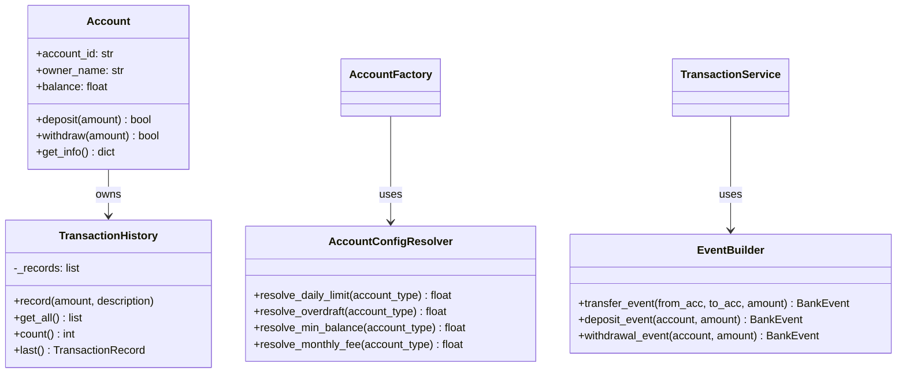

# Jour 06 — Single Responsibility Principle (SRP)

## Le principe

> "Une classe ne devrait avoir qu'une seule raison de changer."
> — Robert C. Martin

Une "raison de changer" = un acteur (une équipe, un métier, un besoin)
qui pourrait demander une modification. Si deux équipes différentes doivent
modifier la même classe pour des raisons différentes, cette classe viole le SRP.

---

## Les violations dans BankCore

### Violation 1 : `Account` a trois responsabilités

```python
class Account:
    # Responsabilité 1 : modèle de données (owner, balance, account_id)
    # Responsabilité 2 : règles métier (withdraw, deposit, validations)
    # Responsabilité 3 : historique des transactions (_transactions, get_transactions)
```

**Qui veut changer quoi ?**
- L'équipe BDD veut changer la structure de `TransactionRecord` → touche `Account`
- L'équipe Métier veut changer les règles de retrait → touche `Account`
- L'équipe API veut changer le format de `get_info()` → touche `Account`

Trois équipes, une classe.

### Violation 2 : `AccountFactory` a deux responsabilités

```python
class AccountFactory:
    # Responsabilité 1 : créer des comptes selon leur type
    # Responsabilité 2 : lire la configuration et appliquer les limites
```

La logique de "quelles limites appliquer" appartient à un
`AccountConfigResolver` — pas à la Factory.

### Violation 3 : `TransactionService` connaît trop de détails

`TransactionService` construit lui-même les `BankEvent` avec tous leurs
champs — c'est la responsabilité d'un `EventBuilder`.

---

## La décision

**Extraire trois nouvelles classes :**

1. `TransactionHistory` — gère l'historique des opérations d'un compte
2. `AccountConfigResolver` — résout les limites et frais selon le type de compte
3. `EventBuilder` — construit les `BankEvent` de façon cohérente

`Account`, `AccountFactory` et `TransactionService` perdent des
responsabilités. Ils ne font pas moins — ils font leur chose unique mieux.

---

## Diagramme



---

## Ce que le SRP n'est PAS

**Ce n'est pas :** "une classe = une méthode" ou "une classe = 20 lignes".
Une classe peut être grande si tout ce qu'elle fait relève d'un seul
domaine de responsabilité.

**C'est :** si tu dois expliquer ce que fait une classe avec "et", c'est
probablement une violation. `Account` gère les données **et** l'historique
**et** le format de sortie → violation.

---

## Connexion avec les jours suivants

- **Jour 07 (OCP)** : `AccountConfigResolver` sera étendu sans modification
  grâce à Open/Closed
- **Jour 09 (ISP)** : on vérifiera que les nouvelles interfaces sont précises
- **Jour 10 (DIP)** : `TransactionService` recevra `EventBuilder` par injection

---

## Complexité aujourd'hui

- 3 nouveaux fichiers : `transaction_history.py`, `account_config.py`, `event_builder.py`
- Modifications légères : `account.py`, `account_factory.py`, `transaction_service.py`
- 148 tests existants : **tous doivent passer sans modification**
- Nouveaux tests : `test_srp_refactoring.py`
- Principe clé : **refactoring ≠ réécriture**
