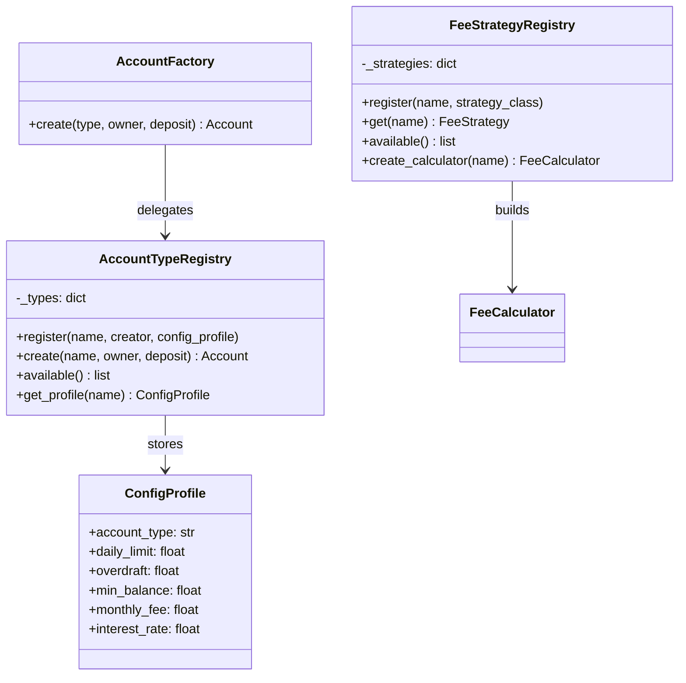

# Jour 07 — Open/Closed Principle (OCP)

## Le principe

> "Les entités logicielles doivent être ouvertes à l'extension
> mais fermées à la modification."
> — Bertrand Meyer (1988), popularisé par Robert C. Martin

**Ouvert à l'extension** : on peut ajouter un nouveau comportement.
**Fermé à la modification** : sans changer le code existant.

En pratique : quand un nouveau besoin arrive, on **ajoute** une classe —
on ne **modifie** pas une classe existante qui fonctionne déjà.

---

## Les violations actuelles dans BankCore

### Violation 1 : `AccountFactory._register_defaults()`

```python
# Ajouter "youth" account = modifier cette méthode
@classmethod
def _register_defaults(cls) -> None:
    cls._creators["current"] = create_current
    cls._creators["savings"] = create_savings
    cls._creators["pro"]     = create_pro
    # ← nouvelle ligne obligatoire à chaque nouveau type
```

### Violation 2 : `AccountConfigResolver._DEFAULTS`

```python
# Ajouter "youth" = modifier ce dictionnaire
_DEFAULTS: dict = {
    "current": {...},
    "savings": {...},
    "pro":     {...},
    # ← nouvelle entrée obligatoire
}
```

### Violation 3 : `FeeCalculator.compare_strategies()`

```python
# Ajouter une stratégie au comparateur = modifier cette méthode
def compare_strategies(self, amount, account_type, strategies=None):
    targets = strategies or [
        StandardFeeStrategy(),
        TieredFeeStrategy(),
        ZeroFeeStrategy(),
        InternationalFeeStrategy(),
        # ← ajouter ici pour chaque nouvelle stratégie
    ]
```

---

## La décision

**Formaliser les points d'extension via des registres explicites.**

Les trois systèmes deviennent **extensibles par enregistrement** :
- `AccountTypeRegistry` : enregistrer un nouveau type de compte
- `AccountConfigResolver` : enregistrement dynamique de profils de config
- `FeeStrategyRegistry` : enregistrer et découvrir les stratégies tarifaires

L'invariant : **ajouter un compte "youth" ne touche aucun fichier existant**.
On crée `youth_account.py`, on appelle `AccountTypeRegistry.register(...)`,
et tout le système le supporte.

---

## Diagramme



---

## Preuve de conformité OCP

**Avant (violation) :** ajouter "youth" account = 3 fichiers modifiés.
**Après (OCP) :** ajouter "youth" account = 1 fichier créé, 0 modifié.

```python
# youth_account.py — nouveau fichier, rien de modifié ailleurs
from bankcore.account import CurrentAccount
from bankcore.account_type_registry import AccountTypeRegistry, ConfigProfile

class YouthAccount(CurrentAccount):
    @property
    def account_type(self): return "youth"

AccountTypeRegistry.register(
    name="youth",
    creator=lambda owner, deposit: YouthAccount(owner, deposit, daily_limit=500.0),
    profile=ConfigProfile("youth", daily_limit=500.0, monthly_fee=0.0),
)
# AccountFactory, AccountConfigResolver, FeeCalculator : inchangés.
```

---

## Connexion avec les jours précédents et suivants

- **Jour 02 (Factory)** : `AccountFactory` devient un proxy vers `AccountTypeRegistry`
- **Jour 06 (SRP)** : `AccountConfigResolver` adopte l'enregistrement dynamique
- **Jour 08 (LSP)** : les nouveaux types enregistrés doivent respecter LSP
- **Jour 10 (DIP)** : les registres seront injectés plutôt qu'accédés globalement

---

## Complexité aujourd'hui

- 2 nouveaux fichiers : `account_type_registry.py`, `fee_strategy_registry.py`
- Mises à jour légères : `account_factory.py`, `account_config.py`
- 182 tests existants : **tous verts sans modification**
- Nouveaux tests : `test_ocp.py`
