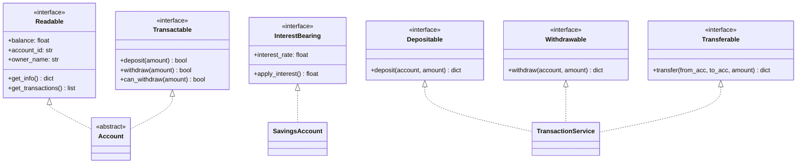

# Jour 09 — Interface Segregation Principle (ISP)

## Le principe

> "Les clients ne devraient pas être forcés de dépendre d'interfaces
> qu'ils n'utilisent pas."
> — Robert C. Martin

En pratique : une grosse interface unique est préférable à plusieurs
petites seulement si **tous** les clients utilisent **toutes** les méthodes.
Dès qu'un client ignore une méthode, l'interface est trop grosse.

**Le signal d'une violation ISP :**
```python
class Account(ABC):
    @abstractmethod
    def deposit(self): ...         # utilisé par tous
    @abstractmethod
    def withdraw(self): ...        # utilisé par tous
    @abstractmethod
    def apply_interest(self): ...  # utilisé UNIQUEMENT par SavingsAccount
    @abstractmethod
    def get_statement(self): ...   # utilisé UNIQUEMENT par l'API client
    @abstractmethod
    def process_fee(self): ...     # utilisé UNIQUEMENT par le scheduler
```

Résultat : `CurrentAccount` doit implémenter `apply_interest()` même si
elle ne s'applique pas — violation ou méthode vide trompeuse.

---

## Les violations dans BankCore

### Violation 1 : `apply_interest()` sur tous les comptes

`SavingsAccount` a `apply_interest()`. Les autres types n'ont pas cette
capacité. Un `InterestService` qui veut appliquer les intérêts doit soit :
- Checker `isinstance(account, SavingsAccount)` → violation LSP (Jour 08)
- Appeler `apply_interest()` et attraper `AttributeError` → fragile

### Violation 2 : `TransactionProcessor` trop large

`TransactionProcessor` expose `deposit`, `withdraw`, `transfer`.
Un `AuditService` n'a besoin que de lire — pas d'écrire.
Un `BatchTransferService` n'a besoin que de `transfer`.
Forcer tous les clients à dépendre de l'interface complète = ISP violé.

### Violation 3 : `AlertObserver` avec `supported_events()`

Certains observateurs ne surchargent pas `supported_events()` — ils
héritent du comportement par défaut `["*"]`. Si `supported_events()`
n'est pas nécessaire pour certains observateurs, l'interface est trop large.

---

## La décision

**Découper en interfaces précises, cohésives et minimales.**

```
Account (core)
├── Readable    → get_info(), get_transactions(), balance
├── Transactable → deposit(), withdraw(), can_withdraw()
├── Transferable → transfer() [via TransactionProcessor]
└── InterestBearing → apply_interest(), interest_rate

TransactionProcessor
├── Depositable  → deposit()
├── Withdrawable → withdraw()
└── Transferable → transfer()

AlertObserver
├── EventHandler  → on_event()  [obligatoire]
└── EventFilter   → supported_events()  [optionnel — mixin]
```

---

## Diagramme



---

## Ce que l'ISP change concrètement

**Avant :**
```python
def apply_all_interest(accounts: list[Account]) -> None:
    for account in accounts:
        account.apply_interest()   # AttributeError si CurrentAccount !
```

**Après :**
```python
def apply_all_interest(accounts: list[InterestBearing]) -> None:
    for account in accounts:
        account.apply_interest()   # Garanti de fonctionner
```

Le type hint `list[InterestBearing]` est un contrat : l'appelant
**ne peut pas** passer un `CurrentAccount` ici. Le compilateur et les
linters le détectent. L'erreur est à la frontière, pas au runtime.

---

## Connexion avec les jours précédents

- **Jour 08 (LSP)** : `InterestBearing` résout la Violation 3 du LSP —
  plus besoin de `isinstance(account, SavingsAccount)`
- **Jour 07 (OCP)** : un nouveau type `PremiumSavingsAccount` peut
  implémenter `InterestBearing` sans toucher à `Account`
- **Jour 10 (DIP)** : les services recevront `Readable`, `Transactable`,
  ou `InterestBearing` selon leur besoin exact — pas `Account` au complet

---

## Complexité aujourd'hui

- 1 nouveau fichier : `interfaces.py` (toutes les interfaces BankCore)
- Modifications : `account.py` déclare les interfaces, `transaction_processor.py`
  adopte les sous-interfaces
- 261 tests existants : **tous verts sans modification**
- Nouveaux tests : `test_isp.py`
