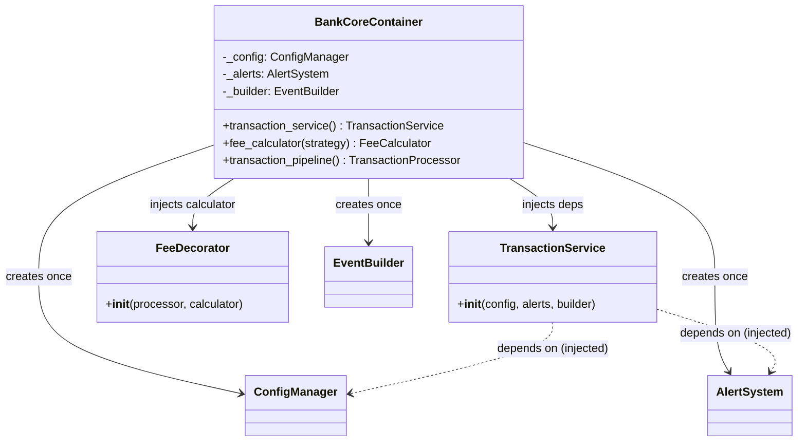

# Jour 10 — Dependency Inversion Principle (DIP)

## Le principe

> "Les modules de haut niveau ne doivent pas dépendre des modules de bas
> niveau. Les deux doivent dépendre d'abstractions. Les abstractions ne
> doivent pas dépendre des détails. Les détails doivent dépendre des
> abstractions."
> — Robert C. Martin

En pratique, deux règles :
1. **Ne pas instancier ses dépendances** — les recevoir de l'extérieur
2. **Dépendre d'interfaces, pas d'implémentations concrètes**

---

## Les violations dans BankCore

### Violation 1 : `TransactionService.__init__()` crée ses dépendances

```python
class TransactionService(TransactionProcessor):
    def __init__(self) -> None:
        self._config       = ConfigManager.get_instance()   # ← concret
        self._alert_system = AlertSystem.get_instance()     # ← concret
        self._builder      = EventBuilder()                 # ← concret
```

**Problèmes :**
- Impossible de tester `TransactionService` sans `ConfigManager` réel
- Impossible d'injecter un `AlertSystem` mock pour isoler les tests
- `TransactionService` connaît `ConfigManager` et `AlertSystem` — couplage fort

### Violation 2 : `FeeDecorator` crée son `FeeCalculator`

```python
class FeeDecorator(TransactionDecorator):
    def __init__(self, processor, fee_calculator=None):
        self._calculator = fee_calculator or FeeCalculator(StandardFeeStrategy())
```

Le fallback `FeeCalculator(StandardFeeStrategy())` hardcode une stratégie.
Changer la stratégie par défaut = modifier `FeeDecorator`.

### Violation 3 : `AccountFactory._register_defaults()` crée `AccountConfigResolver`

```python
def create_current(owner, deposit):
    from bankcore.account_config import AccountConfigResolver
    resolver = AccountConfigResolver()   # ← crée directement
    ...
```

---

## La décision

**Injection de dépendances via les constructeurs.**

Les services reçoivent leurs dépendances — ils ne les créent pas.
On introduit un `Container` (DI Container) pour assembler le système
au point d'entrée (`main.py`).

```
Sans DIP :                    Avec DIP :
TransactionService            Container
    ↓ crée                        ↓ crée + injecte
ConfigManager             ConfigManager → TransactionService
AlertSystem               AlertSystem   → TransactionService
                          EventBuilder  → TransactionService
```

---

## Diagramme



---

## Ce que le DIP change pour les tests

**Avant (Jour 03) :**
```python
def test_transfer_publishes_event():
    # Must reset global Singleton — fragile
    AlertSystem._reset()
    service = TransactionService()   # gets real AlertSystem
    ...
```

**Après (Jour 10) :**
```python
def test_transfer_publishes_event():
    mock_alerts = MockAlertSystem()
    service = TransactionService(
        config=mock_config,
        alert_system=mock_alerts,
        builder=EventBuilder(),
    )
    # No global state involved — clean, fast, deterministic
```

---

## Connexion avec la Semaine 3

Le DIP est le pont entre la Semaine 2 (principes SOLID) et la Semaine 3
(architectures). L'Architecture Hexagonale (Jour 15) et la Clean
Architecture (Jour 12) reposent entièrement sur le DIP :
la logique métier ne connaît que des abstractions,
les détails (BDD, framework, API) sont branchés par injection.

---

## Complexité aujourd'hui

- 1 nouveau fichier : `container.py` (DI Container)
- Modifications : `transaction_service.py` (injection au constructeur)
- 308 tests existants : **tous verts sans modification**
- Nouveaux tests : `test_dip.py`
- Bilan Semaine 2 : **5 principes SOLID, tous prouvés par des tests**
