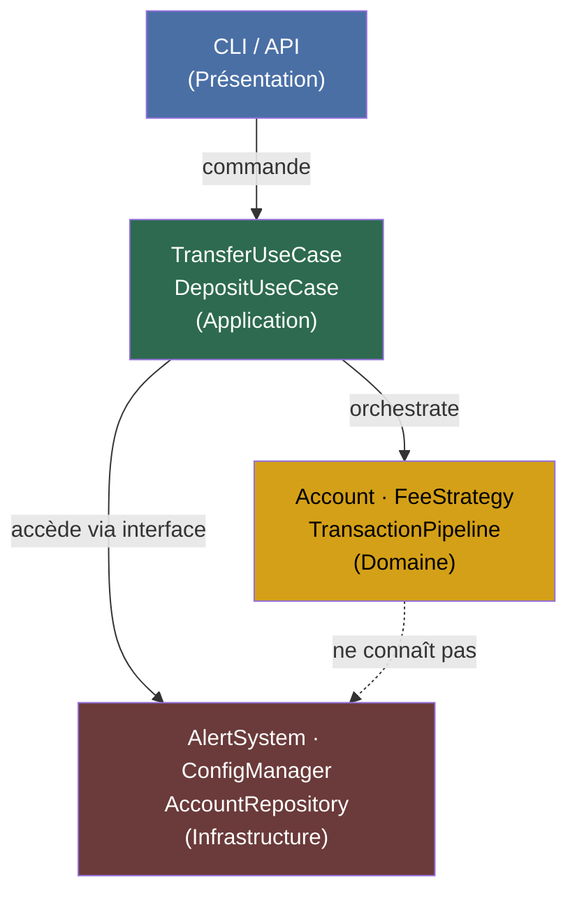

# Jour 11 — Architecture en Couches (Layered Architecture)

## Le principe

L'architecture en couches organise le code en niveaux hiérarchiques
où chaque couche ne dépend que de la couche immédiatement inférieure.
Aucune couche ne "saute" une autre. La communication est unidirectionnelle.

```
┌─────────────────────────────────────┐
│  Couche Présentation (API / CLI)    │  ← reçoit les requêtes
├─────────────────────────────────────┤
│  Couche Application (Use Cases)     │  ← orchestre les opérations
├─────────────────────────────────────┤
│  Couche Domaine (Business Logic)    │  ← règles métier pures
├─────────────────────────────────────┤
│  Couche Infrastructure (BDD, IO)    │  ← détails techniques
└─────────────────────────────────────┘
```

**La règle d'or :** les dépendances pointent vers le bas.
La couche Domaine ne connaît pas la BDD. La couche Application
ne connaît pas HTTP. La couche Présentation ne connaît pas SQLAlchemy.

---

## Où BankCore en était avant ce jour

Après 10 jours, BankCore a des classes bien conçues mais pas d'organisation
en couches explicite. Tout coexiste dans `src/bankcore/` :

```
src/bankcore/
├── account.py              ← Domaine
├── transaction_service.py  ← Application
├── alert_system.py         ← Infrastructure (notification)
├── config_manager.py       ← Infrastructure (config)
├── account_factory.py      ← Application
└── ...
```

Un développeur qui arrive ne sait pas où est la logique métier,
où est l'orchestration, où sont les détails techniques.

---

## La décision

**Réorganiser BankCore en 4 couches explicites.**

```
src/bankcore/
├── presentation/           ← Couche 4 : CLI, API handlers (Jour 15)
│   └── cli.py
├── application/            ← Couche 3 : Use cases, orchestration
│   ├── transfer_use_case.py
│   ├── deposit_use_case.py
│   └── account_use_case.py
├── domain/                 ← Couche 2 : Entités, règles métier pures
│   ├── account.py          (déjà existant)
│   ├── events.py           (déjà existant)
│   └── fee_strategy.py     (déjà existant)
└── infrastructure/         ← Couche 1 : BDD, notifications, config
    ├── config_manager.py   (déjà existant)
    ├── alert_system.py     (déjà existant)
    └── repositories/       (Jour 14)
```

---

## Les Use Cases — le cœur de la couche Application

Un Use Case encapsule **une opération métier complète** :
- Valide les préconditions
- Orchestre les services de domaine
- Gère les erreurs métier
- Retourne un résultat structuré

```python
# Avant : code client orchestrait lui-même
pipeline = build_pipeline(TransactionService())
result = pipeline.transfer(alice, bob, 500.0)

# Après : Use Case encapsule tout
use_case = TransferUseCase(container)
result = use_case.execute(TransferCommand(
    from_account_id="ACC-001",
    to_account_id="ACC-002",
    amount=500.0,
    initiated_by="user-123",
))
```

---

## Diagramme



---

## Ce que la couche Application apporte

**Avant les Use Cases :** la logique d'orchestration était éparpillée.
Les tests de l'API devaient connaître `TransactionService`, `FeeCalculator`,
`AlertSystem`, `AccountFactory` — toute la machinerie interne.

**Après les Use Cases :** l'API appelle `TransferUseCase.execute(command)`.
Le Use Case est l'unité testable au niveau "feature".
Un test de Use Case vérifie le comportement observable, pas l'implémentation.

---

## Connexion avec les jours suivants

- **Jour 12 (Clean Architecture)** : la couche Domaine sera isolée de tout,
  y compris de la couche Application — les Use Cases dépendront d'interfaces
  abstraites, pas des classes concrètes de domaine
- **Jour 14 (Repository)** : la couche Infrastructure recevra
  `AccountRepository` — les Use Cases dépendront de l'interface, pas de SQLite
- **Jour 15 (Hexagonale)** : les Use Cases seront les "ports internes"
  de l'architecture hexagonale

---

## Complexité aujourd'hui

- Nouvelle structure : `application/` avec 3 Use Cases
- 2 nouveaux fichiers : `use_cases.py`, `commands.py`
- 340 tests existants : **tous verts sans modification**
- Nouveaux tests : `test_layered_architecture.py`
