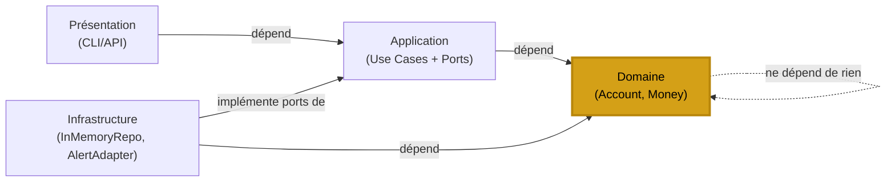

# Jour 12 — Clean Architecture (Onion / Hexagonale intérieure)

## Le principe

Robert C. Martin (2012) : les couches s'organisent en cercles concentriques.
La règle de dépendance est absolue : **le code ne peut dépendre que
de quelque chose situé plus au centre.**

```
        ┌──────────────────────────────────────────┐
        │         Infrastructure / Frameworks       │
        │   ┌──────────────────────────────────┐   │
        │   │     Interface Adapters (API)      │   │
        │   │   ┌──────────────────────────┐   │   │
        │   │   │   Application (UseCases) │   │   │
        │   │   │  ┌────────────────────┐  │   │   │
        │   │   │  │  Domain (Entities) │  │   │   │
        │   │   │  │  ← règles métier   │  │   │   │
        │   │   │  └────────────────────┘  │   │   │
        │   │   └──────────────────────────┘   │   │
        │   └──────────────────────────────────┘   │
        └──────────────────────────────────────────┘
```

**Différence avec Layered (J11) :**
- Layered : les couches dépendent de la couche immédiatement inférieure
- Clean : toutes les couches dépendent uniquement du Domaine central
- Le Domaine ne dépend de rien — ni framework, ni BDD, ni bibliothèque

---

## Le problème dans BankCore

Après J11, le Domaine a encore des dépendances cachées :

```python
# account.py — Domaine
from bankcore.transaction_history import TransactionHistory  # ← détail impl.
from bankcore.interfaces import Readable, Transactable       # ← OK, abstractions

# account_factory.py — Domaine ?
from bankcore.account_config import AccountConfigResolver    # ← Infrastructure
from bankcore.account_type_registry import AccountTypeRegistry # ← Infrastructure
```

La Clean Architecture exige que le Domaine soit **pur** :
seules les entités et les règles métier — rien d'autre.

---

## La décision

**Introduire les couches Clean Architecture formellement.**

```
src/bankcore/
├── domain/                 ← Entités pures, règles métier, interfaces
│   ├── entities/
│   │   ├── account.py      ← Account (pur, sans import externe)
│   │   └── money.py        ← Value Object Money
│   ├── value_objects.py    ← TransactionRecord, AccountId
│   └── domain_events.py   ← DomainEvent (différent de BankEvent)
├── application/            ← Use Cases, Commands (existant J11)
│   ├── commands.py
│   ├── use_cases.py
│   └── ports.py            ← Interfaces que l'Application définit
│                             (AccountRepository, NotificationPort)
├── infrastructure/         ← Implémentations concrètes
│   ├── persistence/
│   │   └── in_memory_repo.py
│   └── notifications/
│       └── alert_system_adapter.py
└── presentation/           ← CLI, API (J15)
```

---

## Les Ports — clé de la Clean Architecture

Les **Ports** sont des interfaces définies par la couche Application.
La couche Infrastructure les implémente.

```python
# Application définit ce dont elle a besoin (Port)
class AccountRepositoryPort(ABC):
    @abstractmethod
    def save(self, account: Account) -> None: ...

    @abstractmethod
    def find_by_id(self, account_id: str) -> Optional[Account]: ...

# Infrastructure implémente (Adapter)
class InMemoryAccountRepository(AccountRepositoryPort):
    def save(self, account): self._store[account.account_id] = account
    def find_by_id(self, id): return self._store.get(id)
```

La règle : **le Port est dans l'Application, l'Adapter est dans l'Infrastructure.**
L'Application ne sait jamais si les données viennent de SQLite, PostgreSQL ou de la mémoire.

---

## Value Objects — Money

Un `Money` représente un montant avec sa devise.
C'est un Value Object du Domaine : immuable, comparable, sans identité propre.

```python
m1 = Money(100.0, "EUR")
m2 = Money(50.0,  "EUR")
m3 = m1 + m2   # Money(150.0, "EUR")
m4 = m1 - m2   # Money(50.0, "EUR")
# m1 + Money(100.0, "USD")  → ValueError (incompatible currencies)
```

---

## Diagramme des dépendances



---

## Ce qui NE change PAS

Les 382 tests existants passent sans modification.
On ajoute des couches, on ne réécrit pas ce qui existe.
La Clean Architecture est une **organisation**, pas une réécriture.

---

## Complexité aujourd'hui

- 3 nouveaux fichiers : `domain/value_objects.py`, `domain/domain_events.py`,
  `application/ports.py`
- 1 nouveau fichier infrastructure : `infrastructure/in_memory_repository.py`
- Les Use Cases (J11) sont mis à jour pour utiliser les Ports
- 382 tests existants : **tous verts sans modification**
- Nouveaux tests : `test_clean_architecture.py`
