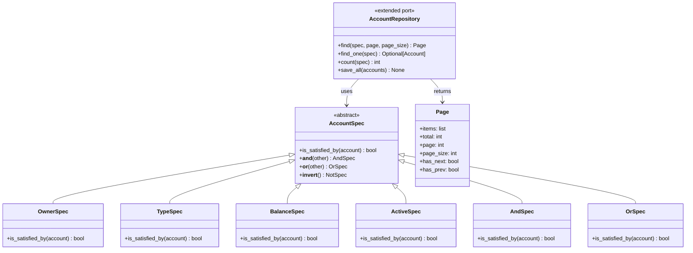

# Jour 14 — Repository Pattern

## Le principe

> "Médiatise entre le domaine et les couches de mapping de données
> en utilisant une interface de type collection pour accéder
> aux objets du domaine."
> — Martin Fowler, Patterns of Enterprise Application Architecture (2002)

Le Repository se présente comme une **collection d'objets domaine**.
Il cache tous les détails de persistence : SQL, ORM, cache, API distante.
Le code qui utilise un Repository ne sait pas d'où viennent les données.

---

## Ce qu'on avait vs ce qu'on veut

**Avant J14 (AccountRepositoryPort) :**
```python
class AccountRepositoryPort(ABC):
    def save(self, account): ...
    def find_by_id(self, id): ...
    def find_all(self): ...
    def find_by_owner(self, name): ...
    def count(self): ...
    def exists(self, id): ...
```

C'est un bon début (J12), mais un vrai Repository en production a besoin de :
- **Spécifications** : requêtes complexes sans proliférer les méthodes
- **Pagination** : ne jamais charger 100 000 comptes en mémoire
- **Tri** : `find_all(order_by="balance", desc=True)`
- **Transactions unitaires** : sauvegarder plusieurs objets atomiquement (Unit of Work)

---

## La décision

**Enrichir `AccountRepositoryPort` avec le Specification Pattern et la pagination.**

```python
# Avant : une méthode par requête (prolifération)
repo.find_by_owner("Alice")
repo.find_by_type("savings")
repo.find_by_balance_above(1000)
repo.find_active_savings_above_1000()  # ← ça n'arrête pas

# Après : Specification Pattern (composable)
spec = OwnerSpec("Alice") & TypeSpec("savings") & BalanceSpec(min=1000)
results = repo.find(spec, page=1, page_size=20)
```

---

## Diagramme



---

## Specification Pattern — pourquoi c'est puissant

```python
# Requêtes composables, lisibles, testables indépendamment
vip_savings = (
    TypeSpec("savings")
    & BalanceSpec(min=10_000)
    & ~FrozenSpec()           # NOT frozen
)

# Tous les comptes éligibles aux intérêts
interest_eligible = TypeSpec("savings") & BalanceSpec(min=50)

# Pagination automatique
page = repo.find(interest_eligible, page=1, page_size=50)
for account in page.items:
    apply_interest(account)
```

---

## Unit of Work — atomicité multi-objets

Un virement implique deux comptes. Le Repository standard sauvegarde
un objet à la fois. Si la sauvegarde du crédit échoue après le débit,
on a un problème de cohérence.

`UnitOfWork` coordonne :
```python
with UnitOfWork(repo) as uow:
    alice = uow.accounts.find_by_id("ACC-001")
    bob   = uow.accounts.find_by_id("ACC-002")
    alice.withdraw(500)
    bob.deposit(500)
    uow.commit()   # les deux ou aucun
```

---

## Connexion avec les jours précédents et suivants

- **J12 (Ports)** : `AccountRepositoryPort` est étendu, pas remplacé
- **J13 (Schema)** : les Specifications se traduisent en SQL WHERE clauses
- **J15 (Hexagonale)** : le Repository est un Port secondaire (driven adapter)

---

## Complexité aujourd'hui

- 3 nouveaux fichiers : `specifications.py`, `repository.py` (étendu),
  `unit_of_work.py`
- `SQLiteAccountRepository` mis à jour avec `find(spec)`
- 473 tests existants : **tous verts sans modification**
- Nouveaux tests : `test_repository_pattern.py`
