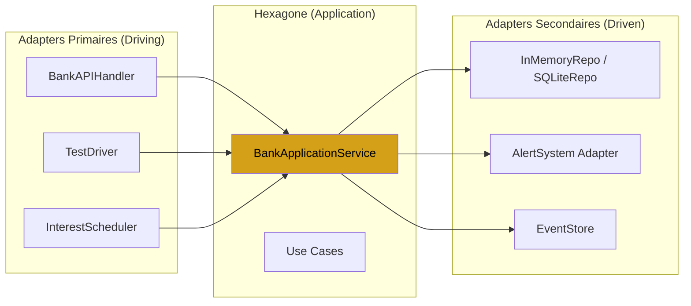

# Jour 15 — Architecture Hexagonale (Ports & Adapters)

## Le principe

Alistair Cockburn (2005) :

> "Permettre à une application d'être pilotée aussi bien par des
> utilisateurs, des programmes, des tests automatisés ou des scripts,
> et d'être développée et testée isolément de ses dispositifs
> et bases de données d'exécution."

L'hexagone n'est pas une forme — c'est une métaphore visuelle
pour "plusieurs côtés égaux". Chaque côté est un Port.

```
         ┌─────────────────────────────────┐
 CLI ────>│  Port Primaire (driving)        │
          │                                 │
 API ────>│      BankApplicationService     │<──── AccountRepository
          │      (Use Cases / Domain)       │
Tests ───>│                                 │<──── AlertSystem
          │  Port Secondaire (driven)       │
         └─────────────────────────────────┘
```

---

## Deux types de Ports

**Ports primaires (driving / left side)**
Ce sont les façons d'appeler BankCore.
L'acteur externe initie l'interaction.
- CLI (ligne de commande)
- API REST (HTTP)
- Tests d'intégration
- Job scheduler (appliquer les intérêts chaque mois)

**Ports secondaires (driven / right side)**
Ce sont les façons dont BankCore appelle l'extérieur.
BankCore initie l'interaction.
- `AccountRepositoryPort` (J12/J14) → SQLite, InMemory
- `NotificationPort` (J12) → AlertSystem, Email, SMS
- `DomainEventStorePort` (J12) → InMemory, SQLite

---

## Ce que ça change concrètement

**Avant J15 :** un développeur qui veut tester BankCore doit instancier
`BankContainer`, câbler les repos, instancier les Use Cases...

**Après J15 :** il appelle `TestDriver` — un Adapter primaire qui
s'occupe de l'orchestration. Le test lui-même est aussi simple que :

```python
driver = TestDriver.create()
driver.create_account("Alice", "current", 1_000.0)
driver.transfer("Alice", "Bob", 500.0)
assert driver.balance("Alice") == 500.0
```

---

## Diagramme complet



---

## Les trois Adapters primaires de J15

1. **TestDriver** — API fluente pour les tests d'intégration sans HTTP
2. **InterestScheduler** — applique les intérêts à tous les comptes éligibles
3. **BankAPIHandler** — simule un handler HTTP (préfigure une vraie API REST)

Pas de `BankCLI` : une interface texte interactive n'a pas été construite
ce jour-là — seuls les trois adapters ci-dessus existent dans
`presentation/`.

---

## Règle d'or

> "Les Adapters ne contiennent pas de logique métier."

Un Adapter traduit entre le format externe (CLI args, JSON, SQL rows)
et les Commands/Results de l'Application. C'est tout.
Si un Adapter a un `if` lié au métier, c'est une violation.

---

## Connexion avec les jours précédents

- **J11 (Use Cases)** : les Adapters appellent `BankApplicationService`
- **J12 (Ports)** : `AccountRepositoryPort`, `NotificationPort` sont les Ports secondaires
- **J13/J14 (Repo)** : `SQLiteAccountRepository` est un Adapter secondaire
- **J10 (DIP)** : `BankContainer` injecte les bons Adapters secondaires

---

## Complexité aujourd'hui

- 3 nouveaux fichiers dans `presentation/` :
  `test_driver.py`, `scheduler.py`, `api_handler.py`
- 524 tests existants : **tous verts sans modification**
- Nouveaux tests : `test_hexagonal_architecture.py`
