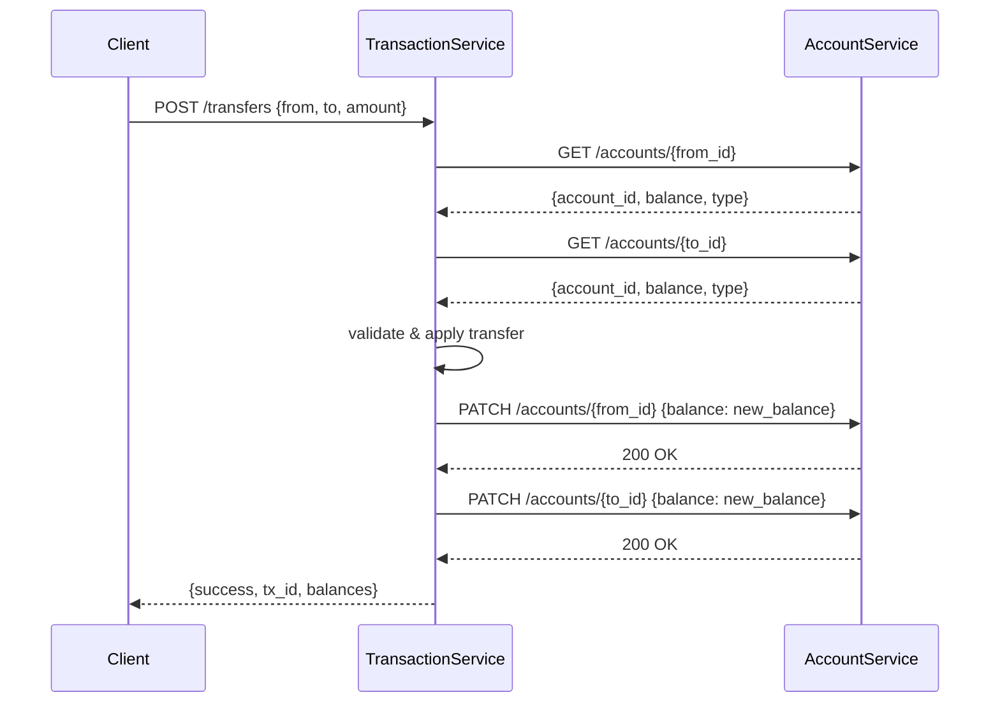

# Jour 16 — Introduction aux Microservices

## Le principe

Un microservice est un service autonome qui :
- Possède ses propres données (no shared database)
- Communique avec les autres via API ou messages
- Peut être déployé, scalé et mis à jour indépendamment
- A une responsabilité unique et bien délimitée

---

## La découpe de BankCore

BankCore monolithique → deux microservices :

```
┌─────────────────────────────────────────────────────┐
│                   MONOLITE (J01-J15)                 │
│  AccountService + TransactionService + AlertSystem   │
└─────────────────────────────────────────────────────┘
                          │
                          ▼ découpe
┌──────────────────┐     HTTP/RPC    ┌──────────────────────┐
│  AccountService  │ ──────────────> │  TransactionService  │
│                  │                 │                       │
│  - créer compte  │ <────────────── │  - virement          │
│  - lire compte   │                 │  - dépôt             │
│  - lister        │                 │  - historique        │
│                  │                 │                       │
│  Port: 8001      │                 │  Port: 8002           │
└──────────────────┘                 └──────────────────────┘
```

---

## Pourquoi cette découpe

**AccountService** : opérations CRUD sur les comptes.
Fréquence de changement : faible (le modèle de compte est stable).
Scalabilité : lecture intensive (dashboard, reporting).

**TransactionService** : traitement des transactions.
Fréquence de changement : élevée (nouvelles règles, nouveaux types).
Scalabilité : write intensive, burst lors des pics (paie, virements de masse).

---

## Communication inter-services

### Synchrone (HTTP) — J16
Pour les opérations qui nécessitent une réponse immédiate :
```
TransactionService → GET /accounts/{id} → AccountService
TransactionService → PATCH /accounts/{id}/balance → AccountService
```

### Asynchrone (Message Queue) — J18
Pour les opérations qui peuvent attendre :
```
TransactionService → publish("transaction.completed") → Queue → AlertService
```

---

## Le problème du partage de données

**Anti-pattern :** deux services partagent la même BDD.
```
AccountService ──┐
                 ├── shared DB  ← couplage fort, déploiement solidaire
TransactionService─┘
```

**Pattern correct :** chaque service a sa propre BDD.
```
AccountService ── account_db.sqlite
TransactionService ── transaction_db.sqlite
```
Conséquence : les données dupliquées sont un choix délibéré,
pas un bug. La cohérence éventuelle est assumée.

---

## ServiceClient — l'Adapter de communication

Le `ServiceClient` est un Adapter primaire côté client :
```python
# TransactionService utilise AccountService via un client HTTP
account_client = AccountServiceClient(base_url="http://account-service:8001")
account = account_client.get_account("ACC-001")
# Retourne un dict — TransactionService ne connaît pas Account directement
```

---

## Diagramme de séquence



---

## Ce que J16 n'est PAS

J16 ne déploie pas de vrais serveurs HTTP.
C'est trop tôt — Docker et la vraie infrastructure arrivent au J19.

J16 construit :
- La **structure** des deux microservices (leurs responsabilités, leurs APIs)
- Un **ServiceClient** qui simule la communication HTTP
- Un **ServiceRegistry** pour la découverte de services
- Des **tests d'intégration inter-services** qui prouvent que les deux
  services communiquent correctement

---

## Connexion avec les jours suivants

- **J17 (Cache)** : AccountService ajoute un cache Redis sur get_account()
- **J18 (Message Queue)** : TransactionService publie les events dans Kafka/RabbitMQ
- **J19 (Docker)** : chaque microservice devient un container

---

## Complexité aujourd'hui

- 4 nouveaux fichiers : `account_service/service.py`,
  `transaction_service/service.py`, `shared/service_client.py`,
  `shared/service_registry.py`
- 564 tests existants : **tous verts sans modification**
- Nouveaux tests : `test_microservices.py`
