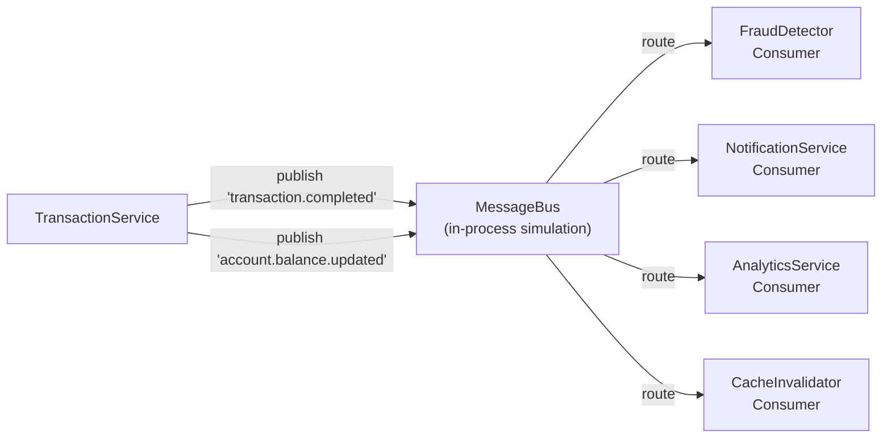

# Jour 18 — Message Queue (Communication Asynchrone)

## Le problème concret

Après un virement réussi, `TransactionService` doit déclencher plusieurs actions :

```python
# AVANT — synchrone, couplé, bloquant
def _transfer(self, request):
    # ... logique virement ...
    self._fraud_service.check(tx)           # bloque si lent
    self._notification_service.send_sms(tx) # bloque si lent
    self._analytics.record(tx)              # bloque si lent
    return response   # ← le client attend tout ça !
```

**Les problèmes :**
- Si `notification_service` tombe, le virement échoue
- Si `analytics` est lent (3s), le virement prend 3s de plus
- `TransactionService` connaît tous ses consommateurs
- Ajouter un nouveau service = modifier `TransactionService`

---

## La solution : Message Queue

```
TransactionService ──publish──> Queue ──consume──> FraudDetector
                                       ──consume──> NotificationService
                                       ──consume──> AnalyticsService
```

`TransactionService` publie un message et retourne immédiatement.
Les consommateurs traitent de façon asynchrone, indépendamment.

---

## Concepts clés

**Exchange / Topic** : catégorie de messages.
`bankcore.transactions` reçoit tous les événements de transaction.

**Queue** : file d'attente d'un consommateur.
`fraud-detection-queue` ne reçoit que les transactions à risque.
`notification-queue` reçoit toutes les transactions.

**Routing Key** : sous-catégorie pour le filtrage.
`transaction.completed`, `transaction.failed`, `account.created`

**At-least-once delivery** : chaque message est livré au moins une fois.
Si le consommateur plante après réception mais avant ack, le message est re-livré.

---

## Architecture BankCore J18



---

## MessageBus — l'abstraction

```python
class MessageBus:
    def publish(self, topic: str, message: dict) -> None: ...
    def subscribe(self, topic: str, consumer: Consumer) -> None: ...
    def subscribe_pattern(self, pattern: str, consumer: Consumer) -> None: ...
```

Implémentation livrée : une seule classe, `MessageBus`, avec un mode
synchrone (par défaut) et un mode asynchrone (`async_dispatch=True`,
dispatch par threads) — pas deux classes séparées.

`RabbitMQBus` / `KafkaBus` n'existent pas dans ce dépôt : ADR-001 exclut
les dépendances tierces (`pika`, `kafka-python`...) de l'application
elle-même. Le container `rabbitmq` du docker-compose (J19) tourne à côté
à titre d'exemple de topologie ; l'application ne le contacte jamais —
c'est `MessageBus` qui joue ce rôle en mémoire, y compris en production
telle que ce challenge la définit (ADR-001).

---

## Dead Letter Queue (DLQ)

Si un consommateur lève une exception, le message va dans la DLQ.
La DLQ permet l'inspection et le re-traitement manuel.

```
Consumer.process(message) raises Exception
    → message moved to DLQ
    → alert sent to ops team
    → TransactionService was NOT affected
```

---

## Idempotency — traiter les doublons

**At-least-once delivery** signifie que des doublons sont possibles.
Chaque message a un `message_id` unique.
Les consommateurs doivent être idempotents :

```python
def process(self, message: Message) -> None:
    if self._already_processed(message.message_id):
        return   # doublon — ignorer
    self._process_new(message)
    self._mark_processed(message.message_id)
```

---

## Connexion avec les jours précédents

- **J03 (Observer)** : MessageBus est l'Observer (J03) à l'échelle des microservices
- **J16 (Microservices)** : TransactionService publie, les autres consomment
- **J17 (Cache)** : `CacheInvalidator` consomme `account.balance.updated`
  et invalide le cache sans que TransactionService le sache

---

## Complexité aujourd'hui

- 3 fichiers : `messaging/message_bus.py`, `messaging/consumers.py`
- `TransactionMicroservice` mis à jour pour publier des messages
- 639 tests existants : **tous verts**
- Nouveaux tests : `test_message_queue.py`
