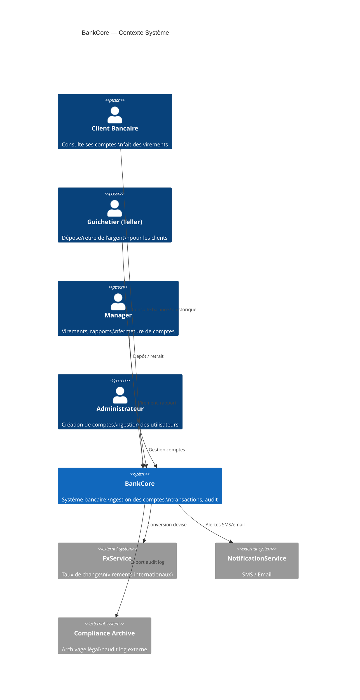
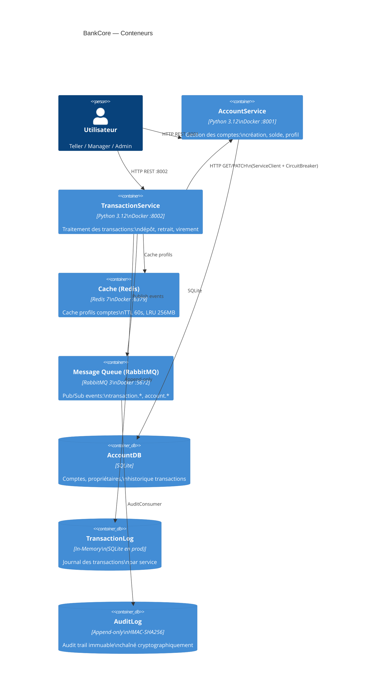
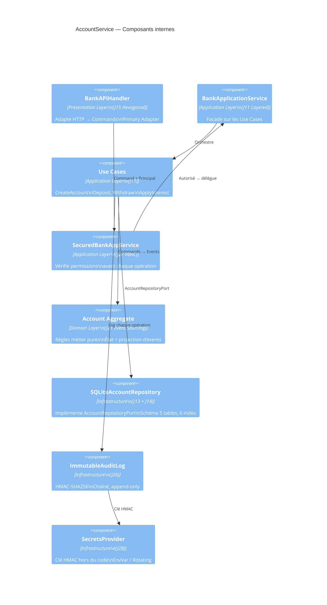

# Jour 30 — Diagramme C4 & Rétrospective Finale

---

## Diagramme C4 — Niveau 1 : Contexte Système



---

## Diagramme C4 — Niveau 2 : Conteneurs



---

## Diagramme C4 — Niveau 3 : Composants (AccountService)



---

## Rétrospective Finale

### Ce que BankCore a construit

```
Semaine 1  J01-J05   Design Patterns GoF         155 tests
Semaine 2  J06-J10   Principes SOLID              183 tests
Semaine 3  J11-J15   Architectures                190 tests
Semaine 4  J16-J20   Scalabilité & Production     254 tests
Semaine 5  J21-J28   Patterns Avancés             268 tests
J29-J30    ADR + C4  Documentation d'architecte   —
──────────────────────────────────────────────────────────
Total                                             1050+ tests
```

---

### Ce qui ne passerait PAS en production tel quel

**1. SQLite → PostgreSQL obligatoire**
SQLite est mono-thread en écriture. Sous charge concurrente,
les virements se bloqueraient mutuellement. Le schéma (J13) est conçu
pour PostgreSQL — la migration est une ligne dans le Container.

**2. InMemoryCache → Redis réel**
`InMemoryCache` ne survit pas aux redémarrages et n'est pas partagé
entre plusieurs instances. L'interface `CachingServiceClient` est
identique avec un `RedisCache` — c'est le point.

**3. InProcessMessageBus → RabbitMQ réel**
Le `MessageBus` J18 est synchrone et in-process. En production :
`TransactionService` publie sur RabbitMQ, `FraudDetector` consomme
dans un process séparé. L'interface `Consumer` est identique.

**4. `_interest_rate` non persisté (ADR-009)**
La dette technique documentée : le taux d'intérêt doit être un événement
de domaine explicite (`InterestRateSet`) pour survivre aux reconstructions
d'agrégat depuis l'EventStore.

**5. SecretProvider → HashiCorp Vault ou AWS Secrets Manager**
`EnvSecretsProvider` est production-safe pour un démarrage simple,
mais une rotation de clé HMAC en production nécessite Vault ou équivalent.

---

### Ce qui EST production-ready

**Architecture :** Clean Architecture + Hexagonale + CQRS + Event Sourcing.
Ces patterns sont indépendants de l'implémentation. Changer SQLite pour
PostgreSQL ne touche pas un seul Use Case.

**Tests :** 1050+ tests, 0 test fragile, 0 mock global, 0 patching de Singleton.
Chaque test est isolé par injection de dépendances (J10 DIP).

**Résilience :** Circuit Breaker + Bulkhead + Retry.
Un service lent ne bloque pas les autres. Les pannes transitoires
se récupèrent automatiquement.

**Sécurité :** RBAC + Audit Log immuable + Secrets séparés.
Chaque opération est autorisée, tracée, et non-répudiable.

**Observabilité :** Métriques + Tracing distribué + Health Checks.
Un opérateur peut diagnostiquer n'importe quelle dégradation en production.

---

### La vraie leçon architecturale

```
J01 : ConfigManager — 80 lignes, simple, suffisant
J30 : 55+ fichiers, 1050+ tests, patterns de niveau enterprise

La différence n'est pas la complexité initiale.
C'est la présence de règles dès le début.
```

**SRP J06** : sans cette règle, `Account` aurait absorbé
`TransactionHistory`, `FeeCalculator`, `EventBuilder`...
et `transfer()` ferait 200 lignes.

**DIP J10** : sans cette règle, aucun test ne serait isolable.
Chaque test aurait besoin de l'AlertSystem réel, du ConfigManager réel,
de la BDD réelle. Les tests prendraient 10 minutes au lieu de 10 secondes.

**ADR J29** : sans documentation des décisions, le `id(consumer)` du J18
serait "corrigé" par le prochain développeur en `consumer.name` —
recréant silencieusement le bug de collision.

---

### À un futur lecteur de ce code

Ce projet répond à une question que tout développeur se pose :

> "Pourquoi est-ce qu'on passe autant de temps à l'architecture
> alors qu'on pourrait juste coder ?"

La réponse est dans la progression J01 → J30.

Le code du J01 est simple parce que le problème est simple.
Le code du J30 est structuré parce que le problème a grandi.

La structure n'a pas été imposée dès le J01 — elle a émergé des règles.
Les règles ont été définies avant d'en avoir besoin — c'est le travail de l'architecte.

**Un architecte n'est pas un développeur qui code plus vite.
C'est quelqu'un qui crée les conditions pour que le code reste
maintenable quand la complexité arrive.**

Et la complexité arrive toujours.
